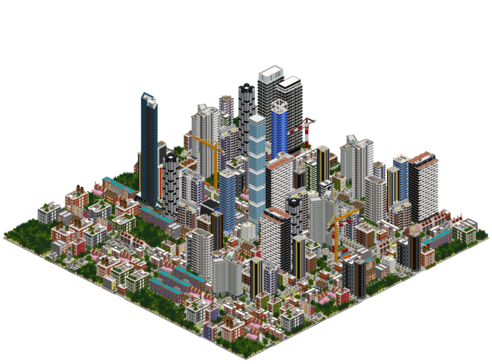
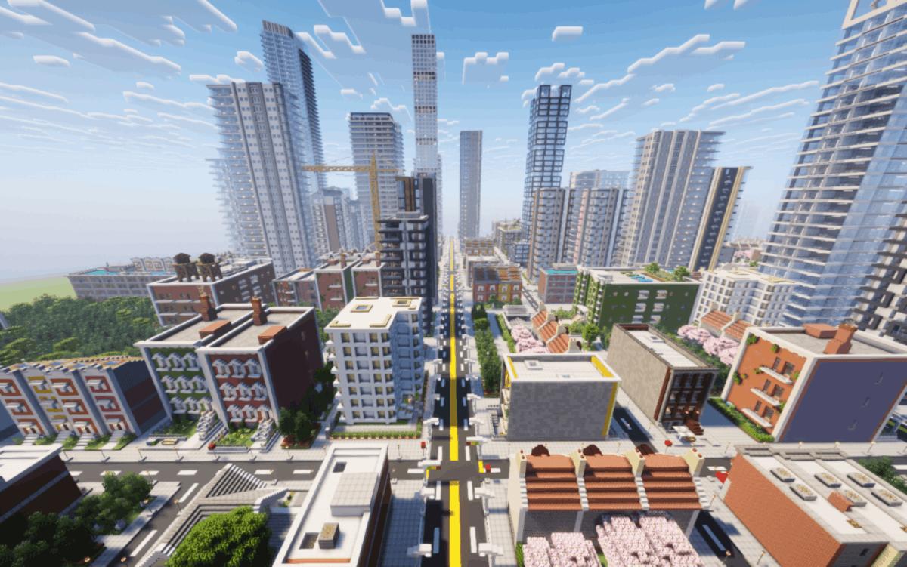
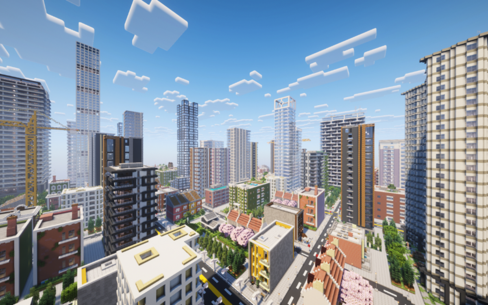
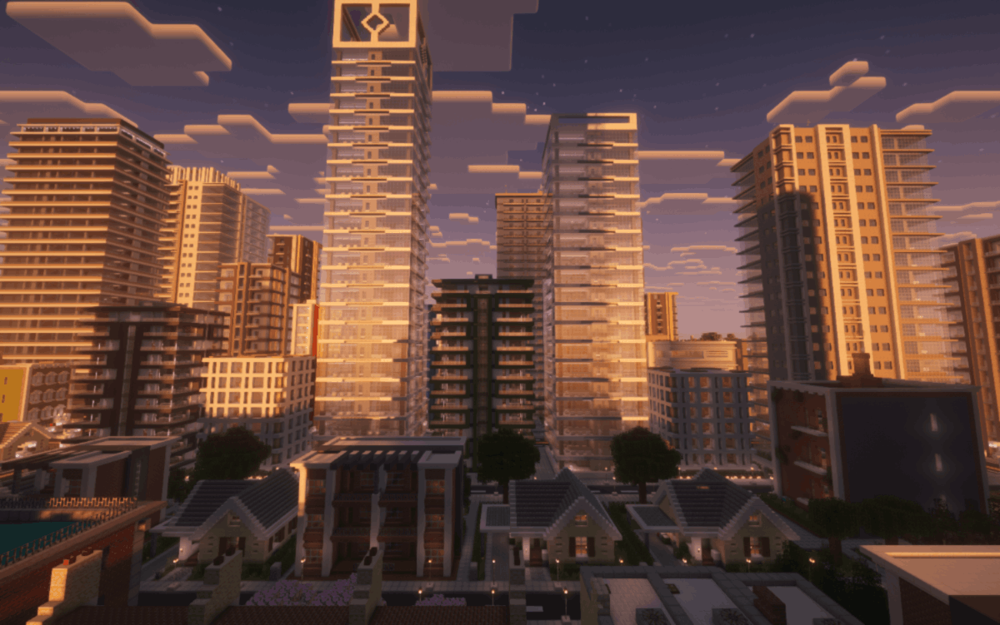
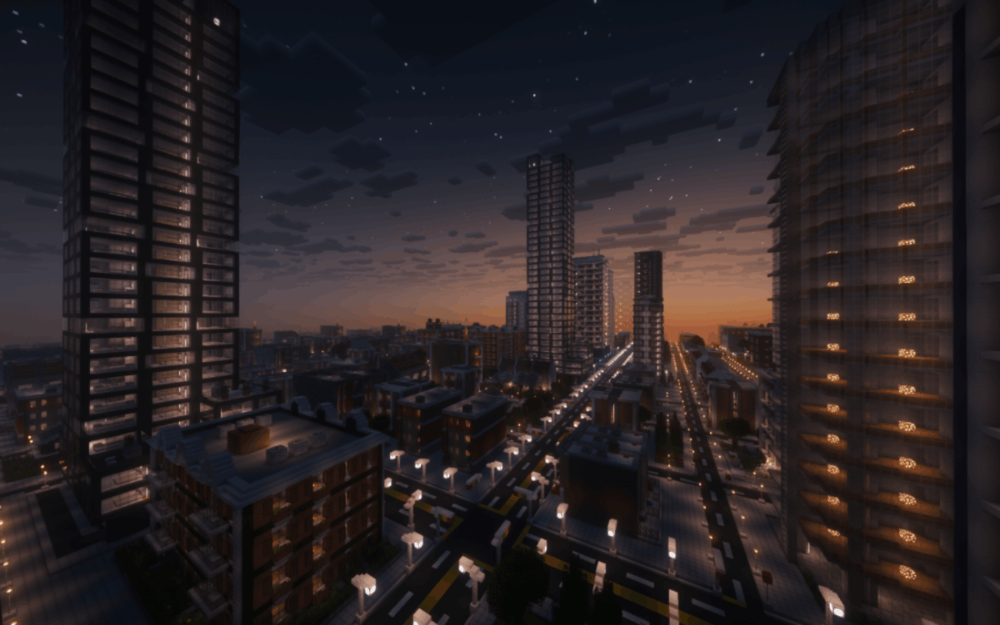
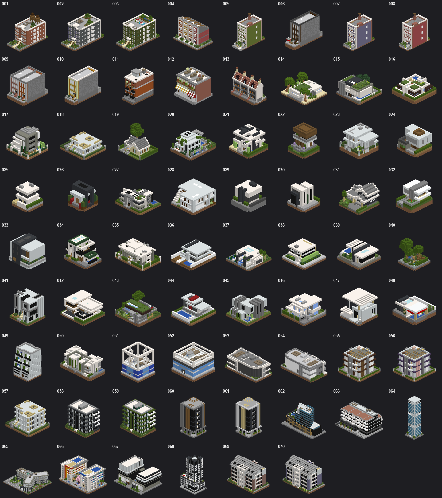
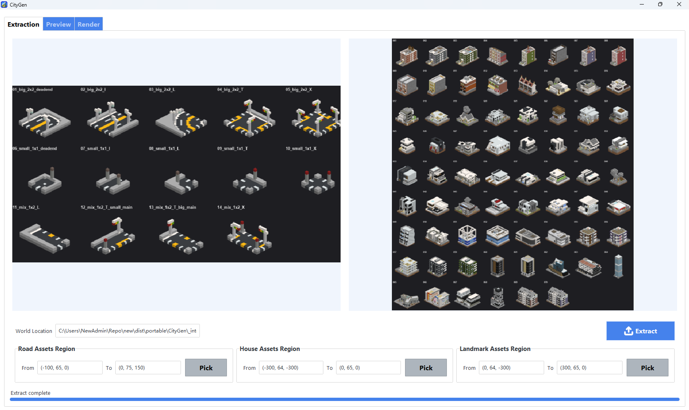
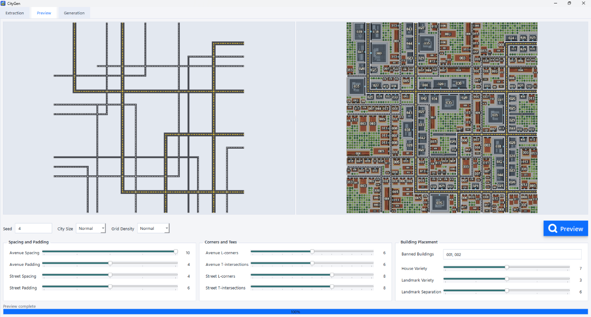
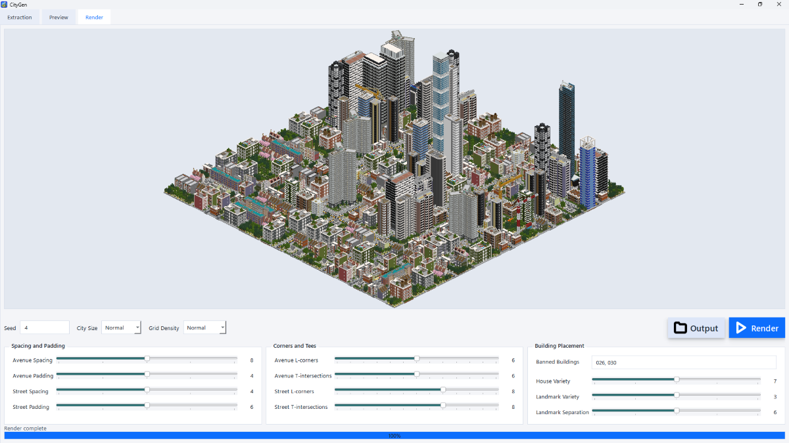

# CityGen - Minecraft City Generator

  

  <h3>
    Download <a href="https://github.com/CDS-SP/minecraft-citygen/releases/download/v0.4.1/CityGen-setup.exe">Windows Installer (.exe)</a> or 
    <a href="https://github.com/CDS-SP/minecraft-citygen/releases/download/v0.4.1/CityGen-portable-windows.zip">Compressed Portable (.zip)</a>
  </h3>

**Build a full Minecraft city from your own roads and buildings in minutes.**

This project turns a small handcrafted asset set into a complete city layout, preview, and paste-ready in-game result. It is designed for creators who want large-scale city generation without giving up the look and feel of their own Minecraft builds.

## Supported Versions

  = 1.20">
  = 7.3.0">

CityGen targets **Minecraft 1.20+** and requires **WorldEdit 7.3.0+** to paste the generated schematics: outputs use the Sponge v3 `.schem` container, which WorldEdit 7.3.0 (the first release for 1.20) introduced and earlier versions cannot read.

> **Note:** WorldEdit 7.3.0's Minecraft coverage depends on the platform — the Bukkit build (Spigot/Paper) supports 1.20–1.20.4, while the Forge build supports 1.20.4 only. Match the WorldEdit build to your server platform and Minecraft version. Verified working on 1.20.4.

## Rendering Result

## In-Game Result

The generated city can be brought back into Minecraft as a real build result:

## Built-in Assets

These buildings come with the app by default:

## Desktop Workflow

The app includes extraction tools, previews, and a generation UI built for iteration:

## What It Is

CityGen is a desktop tool that helps you:

- extract roads and building pieces from a Minecraft world
- generate a full city layout from those pieces
- preview the result before committing to it
- export a city you can bring back into Minecraft

It is not a generic block spammer. The goal is to let you define the visual language, then let the tool scale it into a believable city.

## Why It’s Different

- Your assets, not random prefab packs: the generator works from structures you already built.
- Fast visual iteration: you can see city layouts before producing final output.
- In-game ready: the output is meant to become a real Minecraft city, not just concept art.
- Compact workflow: extraction, preview, generation, and render all live in one app.

## Who It’s For

- Minecraft builders who want to scale a build style into a full district or city
- world creators making urban maps faster
- technical builders who want structure without hand-placing every block
- anyone who wants a city generator that still feels handcrafted

## For Technical Details

Refer to [TECHNICAL.md](docs/TECHNICAL.md)
