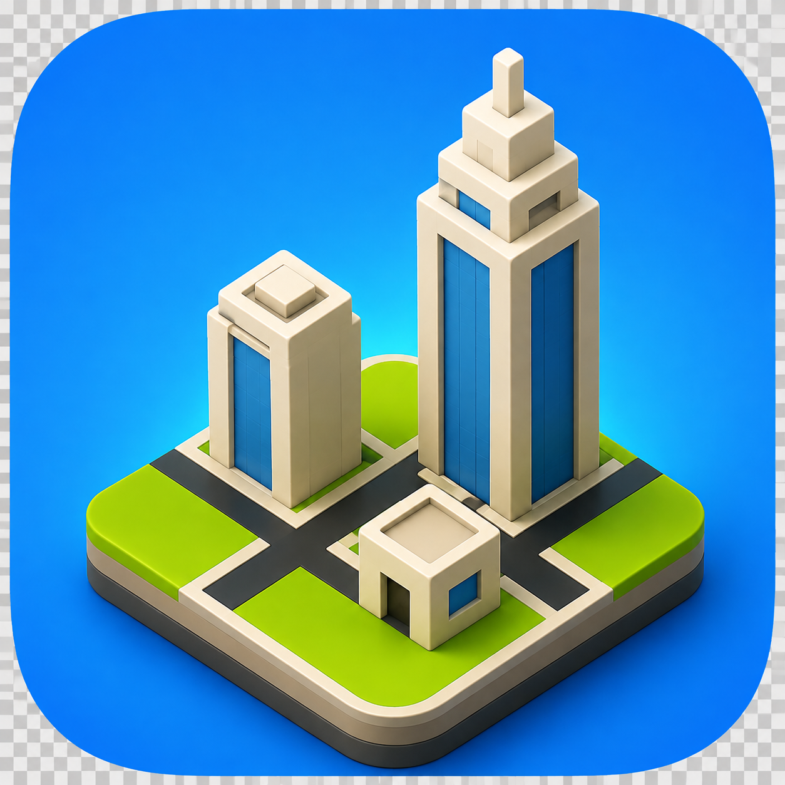
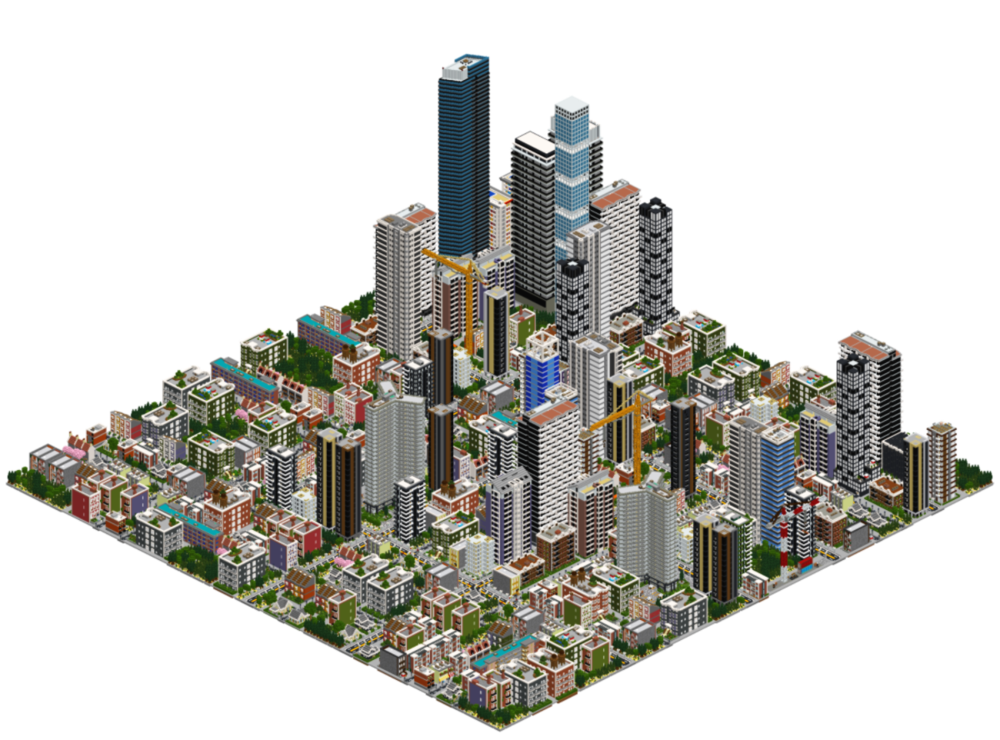
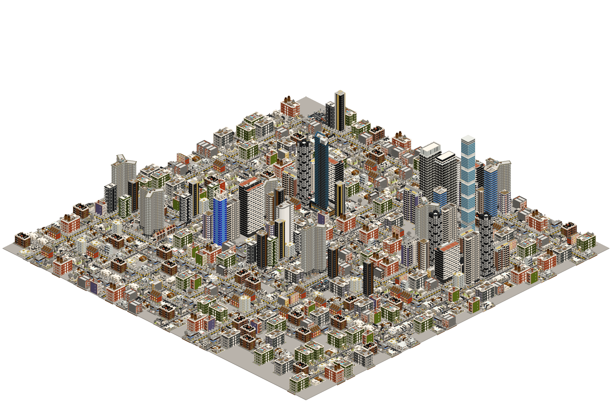
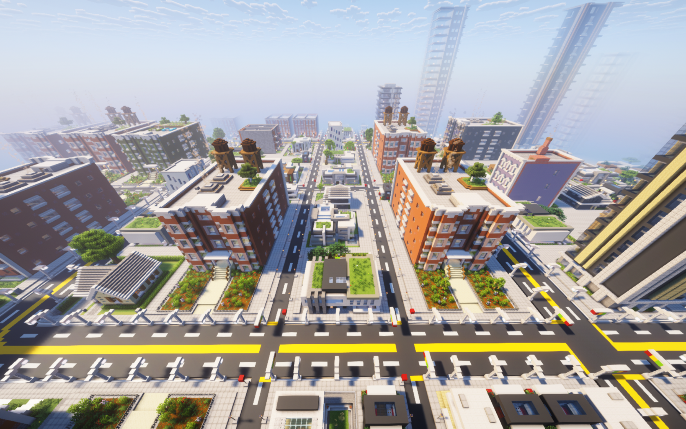
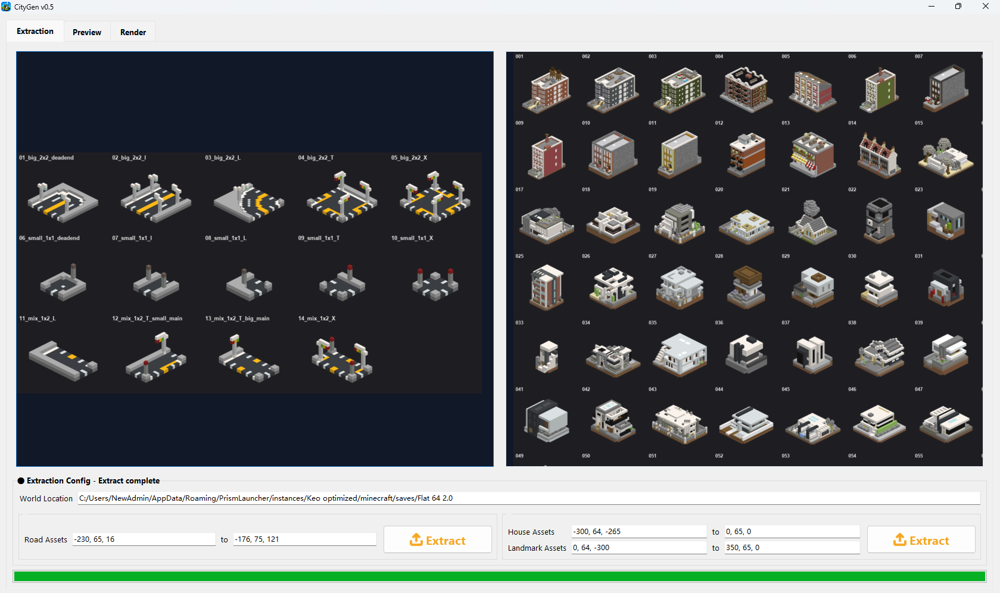

# CityGen - Minecraft City Generator

<p align="center">
  
</p>

**Build a full Minecraft city from your own roads and buildings in minutes.**

This project turns a small handcrafted asset set into a complete city layout, preview, and paste-ready in-game result. It is designed for creators who want large-scale city generation without giving up the look and feel of their own Minecraft builds.




## What It Is

CityGen is a desktop tool that helps you:

- extract roads and building pieces from a Minecraft world
- generate a full city layout from those pieces
- preview the result before committing to it
- export a city you can bring back into Minecraft

It is not a generic block spammer. The goal is to let you define the visual language, then let the tool scale it into a believable city.

## What It Looks Like

### In-Game Result

The generated city can be brought back into Minecraft as a real build result:



### Desktop Workflow

The app includes extraction tools, previews, and a generation UI built for iteration:



## Setup

Install the project into a fresh Python environment:

```bash
python -m pip install -e .
```

Then run the environment check:

```bash
citygen-doctor
```

Or start the desktop app directly:

```bash
citygen
```

If you prefer not to install entry points, these still work:

```bash
python src/config/doctor.py
pythonw application.pyw
```

## Windows Releases

The default Windows release artifact is:

- `dist/release/CityGen-setup.exe`

Release process docs:

- [CHANGELOG.md](docs/CHANGELOG.md)
- [RELEASING.md](docs/RELEASING.md)

Build prerequisites:

```bash
python -m pip install .[build]
```

The installer build includes CPU `numba` acceleration for faster isometric renders. CUDA is not required.

Build command:

```bash
python packaging/build_windows_release.py --clean
```

If you explicitly want extra deliverables for testing, opt in:

```bash
python packaging/build_windows_release.py --clean --include-portable --include-standalone
```

## First-Run Notes

- `tkinter` must be available in your Python install because the desktop app uses Tk.
- the app ships with a bundled default Minecraft Java world, and that is the default extraction source
- set `MC_CITY_SAVE` or paste a different world path into the Extraction tab when you want to override it
- final `.schem` exports are copied into `artifacts/worldedit` by default
- set `MC_CITY_WORLDEDIT_SCHEM` if you want the export copy target somewhere else
- optional speedup: install `numba` with `python -m pip install .[speed]`

## Why It’s Different

- Your assets, not random prefab packs: the generator works from structures you already built.
- Fast visual iteration: you can see city layouts before producing final output.
- In-game ready: the output is meant to become a real Minecraft city, not just concept art.
- Compact workflow: extraction, preview, generation, and render all live in one app.

## Who It’s For

- Minecraft builders who want to scale a build style into a full district or city
- world creators making urban maps faster
- technical builders who want structure without hand-placing every block
- anyone who wants a city generator that still feels handcrafted

## For Technical Details

Refer to [TECHNICAL.md](docs/TECHNICAL.md)
