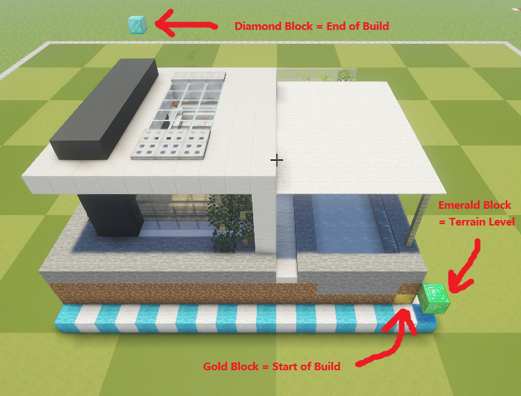
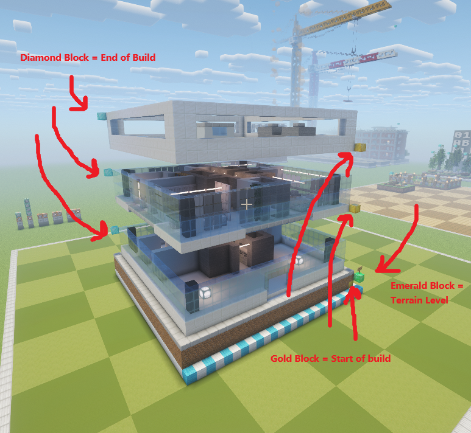

# CityGen Technical Reference

This document is the engineering-side companion to the public overview. It explains how CityGen is structured, how assets are marked in-world, how the road grid is generated, and how final city placement works.

## Requirements, Assumptions, and Limitations

### Runtime Dependencies

- Python `>= 3.10`
- `Pillow`
- `numpy`
- `tkinter` for the desktop GUI
- `ttkbootstrap` for the desktop theme and modern ttk styling

Declared project metadata currently lives in [pyproject.toml](../pyproject.toml), while some runtime imports are used directly in the codebase.

### Minecraft / Schematic Assumptions

- Source world format: Minecraft Java Edition region/chunk data (1.18+ Anvil layout)
- Output schematic format: Sponge `.schem`
- Schematic `DATA_VERSION`: resolved at run time (see Version Compatibility below), not hard-coded
- Intended downstream tool: WorldEdit-compatible schematic workflow

Important note:

- this project is configured around the Java Edition world/schematic pipeline used by the repo
- it is not a Bedrock pipeline
- the source-world reader targets the 1.18+ chunk format; older worlds are not supported

### Version Compatibility

The pipeline copies block strings straight from the source world into the output
schematic, so block *content* is version-transparent. The one thing that is not
is the `DataVersion` stamped on the schematic: WorldEdit upgrades an older
schematic forward into a newer world but cannot downgrade a newer one.

CityGen commits to **forward-only** compatibility. The export target is always
the source world's own version or newer, so every block in the palette is
guaranteed to exist in the target — WorldEdit handles the forward upgrade for
free, and there is no downgrade or "missing block" computation to do.

This is handled by [config/version_compat.py](../src/config/version_compat.py):

- outputs are **always stamped with the source world's `DataVersion`** (from its
  `level.dat`, else a fallback, clamped up to the 1.19.4 hard floor). WorldEdit's
  DataFixer then upgrades the schematic forward into whatever world you paste
  into. Stamping any newer version would skip the fixer and hole out blocks
  renamed since the source (e.g. `grass` → `short_grass`), so we never do it.
- the Extraction tab's **Target Version** dropdown is informational — it records
  the version you plan to paste into (source and newer) but does not change the
  stamp. `DATA_VERSION` is pinned via `MC_CITY_DATA_VERSION` so construct/render,
  which do not set `MC_CITY_SAVE`, stamp the source version rather than
  re-detecting the default world.

The supported floor is Minecraft 1.19.4. One data table drives version
resolution and labelling:

- `RELEASES` — release name ↔ DataVersion

`version_compat.py` loads it from generated JSON shipped as package data
(`src/config/mc_versions.json`). This file is authoritative and required — the
module raises at import if it is missing or unreadable, pointing to the refresh
command below. There is no in-code fallback table.

Refresh workflow:

```bash
python tools/update_mc_versions.py
```

Notes:

- downloads every Java Edition release server JAR from 1.18 upward (cached under
  `tools/`, git-ignored) and reads each jar's `DataVersion` from its bundled
  `version.json`
- versions whose download fails are skipped with a warning so a
  partial-but-valid table is still written
- the generated JSON file is packaged as `config` package data

### Block Entities

Signs, banners, chests, barrels, beds, furnaces, skulls, etc. carry their state
in *block-entity NBT* (sign text, banner patterns, container contents), separate
from the block id. The pipeline preserves that NBT end to end:

- `marker_extract.extract_cuboid` returns `(cells, block_entities)`; each
  `BlockEntity` (see [engine/schematic_transform.py](../src/engine/schematic_transform.py))
  holds a local `(x, y, z)`, the id, and a `Data` compound copied verbatim. The
  gold/diamond/emerald authoring markers live outside the extracted cuboid, so
  in-cuboid signs are kept as real content (not blanked).
- `schematic_writer` emits them into the Sponge `BlockEntities` list (inline for
  the v2 container, nested under `Data` for v3); `schematic_reader.decode_schem_block_entities`
  reads them back.
- through assembly the positions ride along with their blocks: `rot_tile` rotates
  a block entity to its cell's new coordinate (and `rot_state` turns the block's
  own `facing`/`rotation`), `building_schematic.assemble` offsets stacked pieces,
  and `04_city_construct` translates each into master-grid coordinates, clipping
  to bounds and collapsing duplicates (one per cell).

The NBT itself is carried unchanged and, like block ids, is upgraded forward by
WorldEdit's DataFixer on paste because the schematic is stamped with the source
version (e.g. a 1.19.4 sign's `Text1`–`Text4` becomes `front_text`/`back_text` in
1.20+).

### Environment Assumptions

- the app defaults to a bundled world in [src/config/default_world](../src/config/default_world), and `MC_CITY_SAVE` can override it
- the GUI has Windows-oriented behavior in a few places, such as `os.startfile(...)`
- the pipeline expects local filesystem access to the Minecraft save and to the export directory used for `.schem` copy-out

### Practical Limitations

- road generation is orthogonal Manhattan-style only: no diagonal or curved roads
- big roads are `2x2` fine-cell corridors and small roads are `1x1`; the road model is built around that constraint
- mixed road pieces are assumed to be transverse crossings only, not arbitrary overlaps
- build extraction depends on strict marker conventions; if markers are missing or malformed, the build is skipped
- type `1` builds must resolve to exactly `1` cuboid
- type `2` builds must resolve to exactly `3` cuboids: `bottom`, `middle`, `top`
- building footprints are snapped to the fine-cell grid; freeform placement is not supported
- placement quality is bounded by the extracted asset catalog and the road frontage available in the generated layout
- simulation previews are layout-accurate stand-ins, not a production-faithful visual representation

### Recommended Reader Mindset

- treat this project as a structured city assembler, not a fully general procedural urban simulator
- the system is strongest when the source world is prepared carefully and the asset kit follows the expected conventions exactly

## High-Level Model

CityGen has two parallel outputs built from the same source assets:

- `simulation`: fast PNG previews for iteration
- `production`: real Sponge `.schem` output and isometric renders for Minecraft / WorldEdit use

The project flow is:

```text
01 roads   -> road assets
02 builds  -> building assets + catalog
03 grid    -> generated road network
04 city    -> roads + placed buildings
```

The important core unit is:

```text
1 fine cell = 9 simulation pixels = 9 production blocks
```

This is defined by `CELL = 9` in [config/config_algo.py](../src/config/config_algo.py).

## Repository Structure

Core modules:

- [pipeline/01_roads/extract.py](../src/pipeline/01_roads/extract.py): extracts road schematics from the world
- [pipeline/02_builds/extract.py](../src/pipeline/02_builds/extract.py): extracts building schematics and writes `buildings.json`
- [pipeline/03_grid/simulation.py](../src/pipeline/03_grid/simulation.py): renders the road grid preview
- [pipeline/03_grid/construct.py](../src/pipeline/03_grid/construct.py): builds the production road grid schematic
- [pipeline/04_city/simulation.py](../src/pipeline/04_city/simulation.py): renders the full city preview
- [pipeline/04_city/construct.py](../src/pipeline/04_city/construct.py): builds the final city schematic

Core engines:

- [engine/road_network.py](../src/engine/road_network.py): road-network generation and tile compositing rules
- [engine/road_schematic.py](../src/engine/road_schematic.py): turns the road network into a production schematic grid
- [engine/city_layout.py](../src/engine/city_layout.py): lot finding and building placement
- [engine/building_schematic.py](../src/engine/building_schematic.py): assembles extracted building pieces into final buildings
- [engine/render_isometric.py](../src/engine/render_isometric.py): renders `.schem` files to isometric PNGs

Configuration:

- [config/config_world.py](../src/config/config_world.py): world path, extraction regions, marker Y range
- [config/config_algo.py](../src/config/config_algo.py): road-generation and placement tuning
- [config/config_path.py](../src/config/config_path.py): artifact and output paths
- [config/config_render.py](../src/config/config_render.py): render and ground-fill settings

## Pipeline Stages

### 1. Roads

There are two road outputs:

- simulation road tiles: transparent PNGs used for preview rendering
- production road tiles: extracted `.schem` pieces used to build the final road network

The road extractor exports 14 named road pieces from the configured world region in `ROAD_BOX`.

### 2. Builds

The build extractor scans the configured build regions in `BUILD_TYPES`, exports individual `.schem` pieces, and writes `artifacts/builds/production/buildings.json`.

That catalog is the source of truth for city placement.

### 3. Grid

The grid stage generates the road network procedurally from a seed. This is the part that decides avenue/street layout.

### 4. City

The city stage places extracted buildings into non-road cells, then assembles:

- simulation PNG previews
- final production `.schem`
- isometric PNG render

## In-World Asset Conventions

CityGen depends on explicit marker conventions inside the Minecraft source world. These conventions matter because extraction is not based on guesswork; it is driven by marker blocks and boundaries.

## Road Extraction Convention

Road extraction is implemented in [pipeline/01_roads/extract.py](../src/pipeline/01_roads/extract.py) and shares its geometry pass with builds via [engine/marker_extract.py](../src/engine/marker_extract.py). Road tiles, fill props, and buildings all use the **same** marker convention, so there is no bespoke road-detection logic.

Region:

- roads are scanned inside `ROAD_BOX` from [config/config_world.py](../src/config/config_world.py)

Markers (identical to the build convention below):

- a **wool** rectangle bounds each asset; connected wool components separate assets
- one `gold_block` + one `diamond_block` mark two opposite corners of the extracted cuboid
- exactly one `emerald_block` marks ground level
- marker blocks and signs are blanked to air in the saved schematic

How road pieces are found:

- `detect_assets(..., expected_components=1)` resolves each wool-bounded component into a single cuboid (roads are single-solid assets, like a type-`1` build)
- a sign inside the component's boundary provides the exported asset name (e.g. `02_big_2x2_I`)

Practical implication:

- author road tiles exactly like a type-`1` build (wool boundary + gold/diamond/emerald), and name them with a sign
- because markers define the cuboid directly, a tile taller than `ROAD_BOX`'s Y span is still captured in full (markers are searched over `BUILD_MARKER_Y_RANGE`, not the box height)

### Fill Props (empty-space filling)

Fill props are authored in the road region alongside the road tiles, with the same marker convention, and are named `15_fill_1x1_A`, `16_fill_1x1_B`, `17_fill_1x1_C` (the `fill` token in the name is what distinguishes them). Each is a self-contained 9x9 (one fine cell) asset that carries its own ground — in the bundled world these are trees.

- [engine/road_schematic.py](../src/engine/road_schematic.py) keeps them out of `load_tiles()` (so they are never placed as road-network tiles) and exposes them via `load_fillers()`
- [pipeline/04_city/construct.py](../src/pipeline/04_city/construct.py) drops a randomly chosen, randomly rotated fill prop into every fully-empty non-road lot cell, seated on the lot ground plane; cells touched by a building keep the flat ground fill (`smooth_stone_slab`), and prop cells are excluded from that fill so nothing pokes through the prop's own ground
- [pipeline/04_city/simulation.py](../src/pipeline/04_city/simulation.py) mirrors this in the top-down preview using the matching `*_fill_*` PNGs drawn by `pipeline.01_roads.simulation`, with the same seed so the preview lines up with the built city

## Build Extraction Convention

Build extraction is implemented in [pipeline/02_builds/extract.py](../src/pipeline/02_builds/extract.py).

Build regions:

- each build region is declared in `BUILD_TYPES`
- each region carries a `type`
- type `1` and type `2` are handled differently

Boundary convention:

- builds are grouped by connected X/Z components that contain wool anywhere in the allowed Y range
- in practice, wool is the boundary signal that says “this area is one build”

Marker block convention inside each build boundary:

- exactly one `emerald_block`
- one or more `gold_block`
- one or more `diamond_block`

### Emerald Block

The `emerald_block` marks the ground reference for the build.

Technical behavior:

- each build boundary must contain exactly one emerald marker
- its Y position becomes the `ground_offset` reference stored in `buildings.json`
- the final city constructor uses that offset to align the building correctly to city ground

### Gold/Diamond Block Pairs

`gold_block` and `diamond_block` markers define component cuboids.

Technical behavior:

- gold and diamond markers must appear in matching counts
- markers are sorted by Y and paired in order
- each gold/diamond pair defines opposite corners of one extracted cuboid

This means:

- one pair defines one extracted piece
- type `1` builds must resolve to exactly 1 cuboid
- type `2` builds must resolve to exactly 3 cuboids

For type `2`, the three cuboids are exported as:

- `bottom`
- `middle`
- `top`

For type `1`, the whole build is exported as one schematic.

### Type 1 vs Type 2

Type `1`:

- expected components: 1
- typically smaller frontage buildings
- exported as one complete schematic

Type `1` convention example:



Type `2`:

- expected components: 3
- intended for stackable or landmark-style buildings
- exported as bottom/middle/top pieces
- supports height variation and appearance targeting

Type `2` convention example:



### Sign Metadata Inside Build Boundaries

Signs inside build boundaries can add catalog metadata.

Supported sign directives:

- `stack: n` or `stack: min-max`
- `appearance: n` or `appearance: min-max`

Meaning:

- `stack` controls how many middle sections a type-2 building can receive during city construction
- `appearance` controls how many times a type-2 building should appear in a generated city

These signs are parsed, stored in `buildings.json`, and stripped from the final exported schematic pieces.

## Generated Build Catalog

The build catalog is written to:

- `artifacts/builds/production/buildings.json`

Each entry contains:

- `type`
- `size`
- `origin`
- `ground_offset`
- `pieces`
- `stack` for type-2 buildings
- `appearance` for type-2 buildings

This file is the input for both simulation-building stand-ins and final production placement.

## How the Road Grid Is Generated

Road generation lives in [engine/road_network.py](../src/engine/road_network.py).

The generator uses an overlay model with two independent Manhattan networks:

- a big-road network on the coarse grid
- a small-road network on the fine grid

### Fine Grid vs Coarse Grid

- fine grid: the real city cell grid used for building placement
- coarse grid: `fine // 2`

One coarse cell covers `2x2` fine cells.

That is why big roads are effectively 2 cells wide, while small roads are 1 cell wide.

### Three Road Layers

The system composites three kinds of road pieces:

- big `2x2`
- small `1x1`
- mixed `1x2`

Mixed pieces exist because a small road can cross a big corridor transversely. When that happens, the overlap occupies exactly two fine cells, so the mixed art is `1x2`.

### Big-Road Generation

Big roads are generated first.

Mechanics:

- avenue positions are chosen on the coarse grid
- spacing is controlled by `GAP_BIG`
- edge padding is controlled by `PAD_BIG`
- positions are evenly stepped, then jittered slightly by random `-1/0/+1`
- nearby duplicates are collapsed to preserve minimum spacing

Topology shaping:

- some full-span roads are truncated into T intersections
- some row/column pairs are truncated into L corners

Tuning knobs:

- `N_BIG_CORNERS`
- `N_BIG_TEES`

### Small-Road Generation

Small roads are generated after the big network.

Mechanics:

- small streets are chosen on the fine grid
- spacing is controlled by `GAP_SMALL`
- edge padding is controlled by `PAD_SMALL`
- streets are filtered so they do not sit too close to big-road bands

The critical clearance rule is:

- `GAP_MIXED` defines the minimum fine-cell clearance between a small street and a big corridor band

Topology shaping:

- small roads also receive forced L corners and T intersections
- their endpoints can snap either to another small road or to the edge of a big corridor

Tuning knobs:

- `N_SMALL_CORNERS`
- `N_SMALL_TEES`

### Important Overlap Rules

The generator enforces two important structural rules:

- a small road never lives inside a big road footprint except as a transverse mixed crossing
- a small road never runs collinear along a big corridor

This avoids degenerate overlays and keeps road art compositing predictable.

## Simulation Grid Output

Simulation grid output is produced by [pipeline/03_grid/simulation.py](../src/pipeline/03_grid/simulation.py).

It:

- generates the road network from a seed
- loads the preview road PNG assets
- composites them into a top-down grid preview
- optionally rescales the result for UI preview

This is meant to be layout-accurate, not visually production-accurate.

## Production Grid Output

Production grid output is produced by [pipeline/03_grid/construct.py](../src/pipeline/03_grid/construct.py) and [engine/road_schematic.py](../src/engine/road_schematic.py).

It:

- generates the same seed-driven road network
- maps the tile layout to extracted road schematics
- writes a Sponge schematic grid for production use

So the simulation and production grid share the same logical network, but render it differently.

## How Building Placement Works

Building placement lives in [engine/city_layout.py](../src/engine/city_layout.py).

The placement model is intentionally simple and deterministic for a given seed:

- roads define forbidden cells
- all remaining cells are lots
- buildings snap to the 9-block fine-cell grid
- type-2 buildings are placed first
- type-1 buildings fill the remaining frontage

### Lot Detection

`find_lots()` flood-fills all non-road fine cells and groups them into connected lots.

Each lot is then processed for frontage placement.

### Catalog Loading

The catalog loader:

- reads `buildings.json`
- filters out banned building IDs
- computes footprint size in fine cells
- sorts buildings by footprint quality

By default, buildings are sorted descending by:

- physical score `width * depth`
- area in fine cells
- footprint dimensions
- building ID

### Two-Pass Placement

`place_city()` runs in two passes.

Pass 1:

- place type-2 buildings first
- only use frontage on big-road cells
- process longest uninterrupted frontage runs first

Pass 2:

- fill remaining frontage with type-1 buildings
- use ordinary road adjacency on each lot

### Candidate Selection

At each candidate frontage point:

- buildings are checked in sorted order
- the first N fitting candidates are collected
- one is chosen randomly from that top-fit set

The “top N” knobs are:

- `TYPE2_TOP_FIT_CHOICES`
- `TYPE1_TOP_FIT_CHOICES`

This gives variation without abandoning fit quality.

### Repetition and Appearance Control

Type-2 buildings have extra placement rules.

Appearance control:

- each type-2 building can define an `appearance` range
- when a city is generated, one target count is sampled from that range
- once that target is reached, that building stops being placed

Repetition control:

- type-2 buildings cannot repeat within the same coarse-cell window
- the size of that exclusion window is `TYPE2_SAME_COARSE_SPAN`

### Banned Buildings

Specific building IDs can be disabled globally with:

- `BANNED_BUILDINGS`

That filter is applied before placement.

## How the Final City Schematic Is Built

Final city assembly lives in [pipeline/04_city/construct.py](../src/pipeline/04_city/construct.py).

The constructor:

- loads or regenerates the road schematic grid
- loads the build catalog
- generates placements from the same seed
- samples type-2 stack counts
- assembles rotated building schematics
- places roads and buildings into one master 3D grid
- optionally fills non-road ground cells
- writes the result as Sponge schematic

Important details:

- if a grid schematic already exists for the seed, the city constructor can infer `fine` from it
- type-2 height is sampled from the build’s `stack` range
- the final schematic writes an offset so WorldEdit paste origin lands correctly
- a reserved corner marker is written so the player paste anchor is stable

## Simulation vs Production

Simulation:

- road PNGs
- pseudo-build PNGs generated from catalog dimensions
- fast iteration
- layout validation

Production:

- extracted road schematics
- extracted real building schematics
- final combined city schematic
- isometric schematic render

The key design goal is that placement logic should be shared, while visual representation differs.

## Key Configuration Knobs

From [config/config_algo.py](../src/config/config_algo.py):

- `CELL`: blocks/pixels per fine cell
- `FINE`: grid edge in fine cells
- `DEFAULT_SEED`: default generation seed
- `GAP_MIXED`: clearance between small roads and big-road bands
- `GAP_BIG`: spacing of big avenues on the coarse grid
- `GAP_SMALL`: spacing of small streets on the fine grid
- `PAD_BIG`: edge padding for big roads
- `PAD_SMALL`: edge padding for small roads
- `N_BIG_CORNERS`: forced avenue L-corners
- `N_BIG_TEES`: forced avenue T intersections
- `N_SMALL_CORNERS`: forced street L-corners
- `N_SMALL_TEES`: forced street T intersections
- `BANNED_BUILDINGS`: IDs excluded from placement
- `TYPE1_TOP_FIT_CHOICES`: variation depth for type-1 selection
- `TYPE2_TOP_FIT_CHOICES`: variation depth for type-2 selection
- `TYPE2_SAME_COARSE_SPAN`: type-2 repeat exclusion window

From [config/config_world.py](../src/config/config_world.py):

- `ROAD_BOX`: road extraction region
- `BUILD_TYPES`: build extraction regions
- `BUILD_MARKER_Y_RANGE`: Y range scanned for emerald/gold/diamond markers
- `SAVE`: source Minecraft world

Most of these values can also be overridden by environment variables with the `MC_CITY_` prefix.

## Outputs

Typical outputs:

- `artifacts/roads/production/*.schem`
- `artifacts/builds/production/*.schem`
- `artifacts/builds/production/buildings.json`
- `artifacts/grid/production/seed_<n>.schem`
- `artifacts/city/production/seed_<n>.schem`
- `artifacts/*/*/*.png` preview and render images

The final city schematic in `artifacts/city/production/` is a Sponge `.schem` ready to import with WorldEdit.

## Render Color Palette Maintenance

The isometric renderer loads block colors from:

- `src/config/color_render.csv`

That CSV is the renderer palette asset that ships in the package. The generator
used to refresh it is a repo maintenance script and is not part of the runtime app.

Refresh workflow:

```bash
python tools/update_render_colors.py
```

Notes:

- the script always downloads a Minecraft client JAR before regenerating the CSV
- if `--version` is omitted, the script resolves Mojang's latest release from the live version manifest
- downloaded client JARs are stored under `tools/` as `minecraft-client-<version>.jar`
- the script overwrites `src/config/color_render.csv` by default
- it is intended for infrequent manual updates when the target Minecraft version changes
- CSV rows are written with namespaced block ids such as `minecraft:stone`
- packaging already includes only the CSV, via setuptools package data and the PyInstaller release script
- the downloaded JAR is a repo-local maintenance input and should not be committed

## Running the System

GUI entry point:

```bash
pythonw application.pyw
```

Common direct stage runs:

```bash
python -m pipeline.01_roads.extract
python -m pipeline.02_builds.extract
python -m pipeline.03_grid.simulation --seed 5
python -m pipeline.03_grid.construct --seed 5
python -m pipeline.04_city.simulation --seed 5
python -m pipeline.04_city.construct --seed 5
python -m pipeline.04_city.render
```

## Mental Model Summary

If you only remember a few things, remember these:

- roads and buildings are extracted from explicit in-world markers, not inferred magically
- the road network is two layered Manhattan systems: big coarse avenues plus small fine streets
- buildings are placed on the fine grid in two passes: type-2 first, then type-1
- simulation and production share layout logic but render different assets
- `buildings.json` is the bridge between extraction and placement
